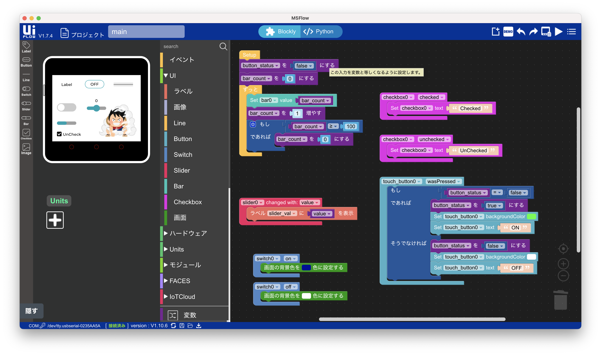
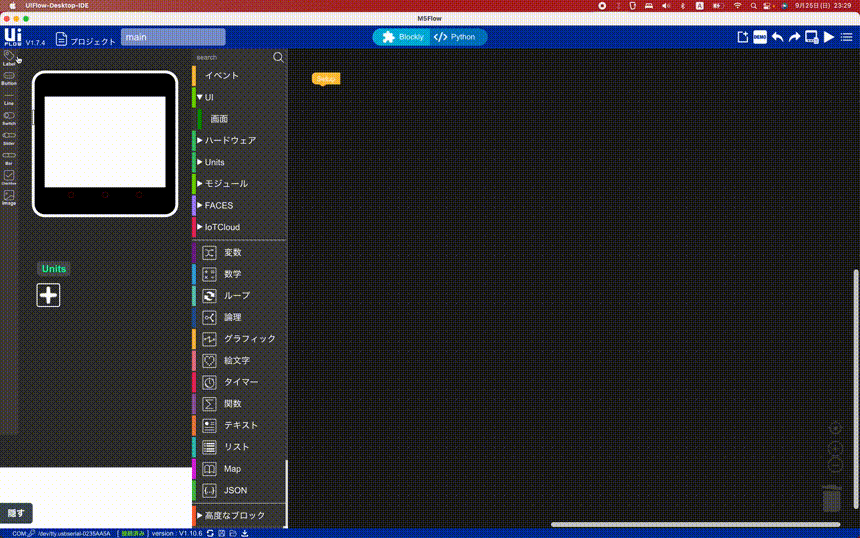
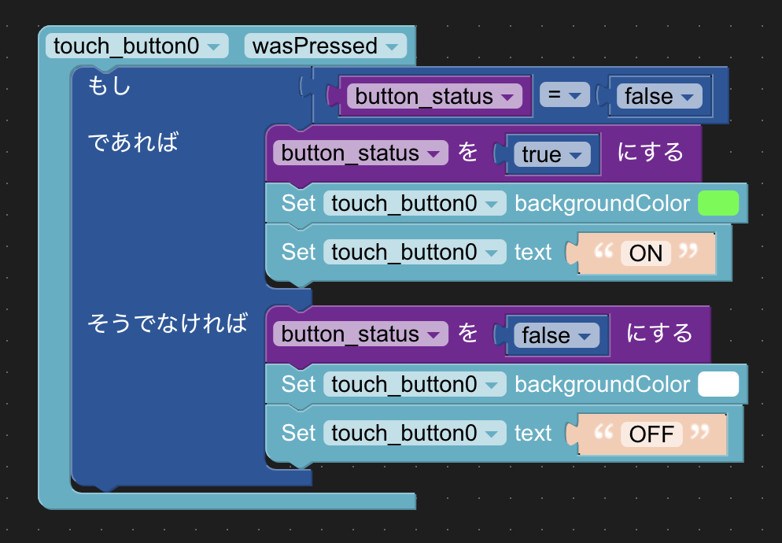
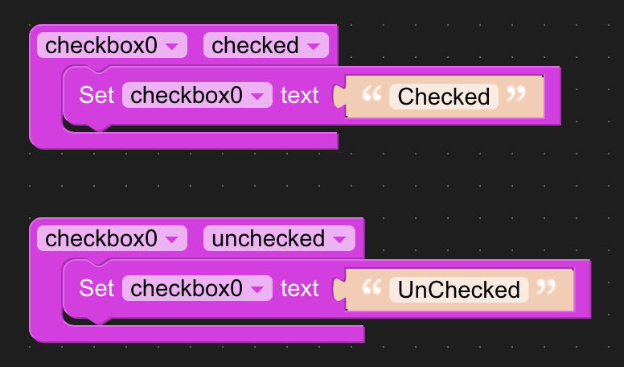
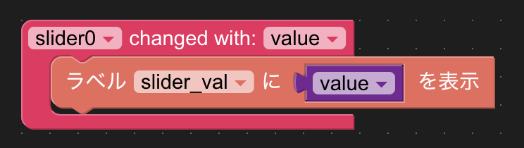
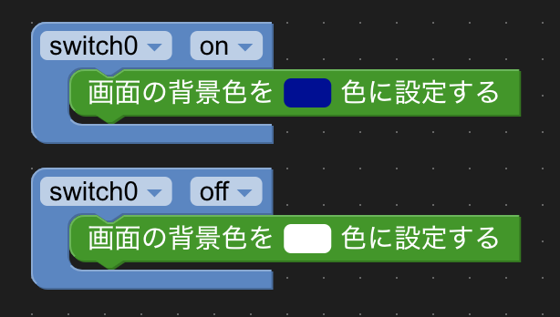
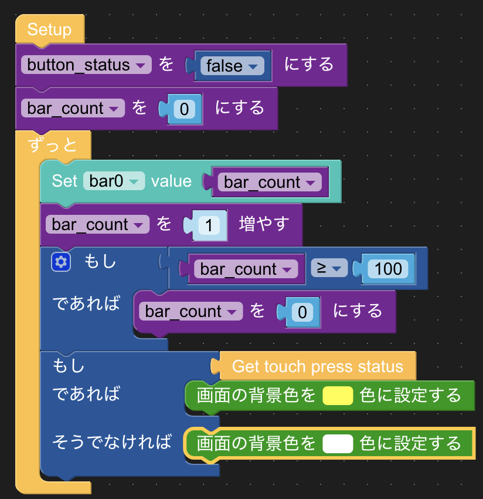

# 第1回 画面表示編

---

## この回でやること

- サンプルプログラムを通じて、基本的な画面表示の仕組みを知る
- 実際に自分なりのUIを作ってみる

---

## サンプルの実行

`uiflow_samples/display`フォルダ内にある`main.m5f`をUIFlowにインポートしてみましょう。

インポートできたら、右上の矢印ボタンを押して実行してみてください。

---

## 解説

ラベルやボタンの追加は左側ペインからドラッグ&ドラッグで行えます。

---

ボタンOn/Off部

---

チェックボックス

---

スライダー

---

トグルスイッチ

---

メイン処理

---

## 応用編

「スマホのスリープ復帰」のようなプログラムを作ってみましょう

1. 基本状態：画面OFF（文字が見えるくらいな状態）、"Sleep"のテキスト表示
2. 画面をタッチすると、画面がON（白色）、"WAKE"のテキスト表示

